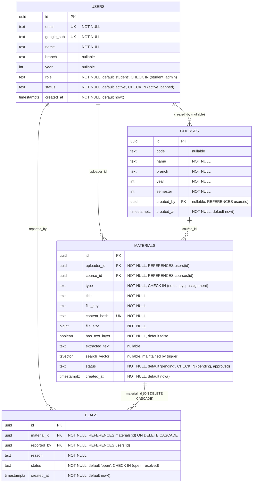

# ER Diagram

Entity-relationship diagram for the IIITOne schema, derived from
`migrations/000001_init_schema.up.sql`.

## Notes

- **`courses` has a unique constraint on `(name, branch, year, semester)`** —
  this is what makes the on-the-fly "find or create" course resolution in the
  material upload flow (`courses.Repository.FindOrCreate`) race-safe via
  `ON CONFLICT (name, branch, year, semester) DO UPDATE`.
- **`materials.status` only has two values: `pending` and `approved`.** There
  is no `rejected` status — rejecting a material (`POST
  /api/admin/materials/{materialID}/reject`, or resolving a flag with
  `material_id`) hard-deletes the row instead of flagging it as rejected.
  This also frees `content_hash` for the same file to be re-uploaded later.
- **`flags.material_id` has `ON DELETE CASCADE`.** When a material is
  hard-deleted (rejected, or deleted while resolving a flag), any other open
  flags referencing it are automatically removed by the database — the
  application code does not need to clean these up itself.
- **`materials.content_hash` is globally unique.** This is the SHA-256 of the
  uploaded file's bytes, used to reject duplicate uploads before they reach
  storage.
- **`materials.search_vector`** is a `tsvector` populated by the
  `materials_search_vector_trigger` (BEFORE INSERT OR UPDATE), combining
  `title` and `extracted_text`, and indexed with a GIN index
  (`materials_search_idx`) to back `GET /api/search`.
- Additional indexes: `materials_course_idx` on `materials(course_id)`, and
  `courses_lookup_idx` on `courses(branch, year, semester)` (backing `GET
  /api/courses`'s filter).
- **`courses.created_by` is nullable** because it's only populated for
  courses created via the on-the-fly resolution path during material upload
  (`courses.Repository.FindOrCreate` is passed the uploader's ID); it's null
  for any course that predates that flow (e.g. seeded directly).
